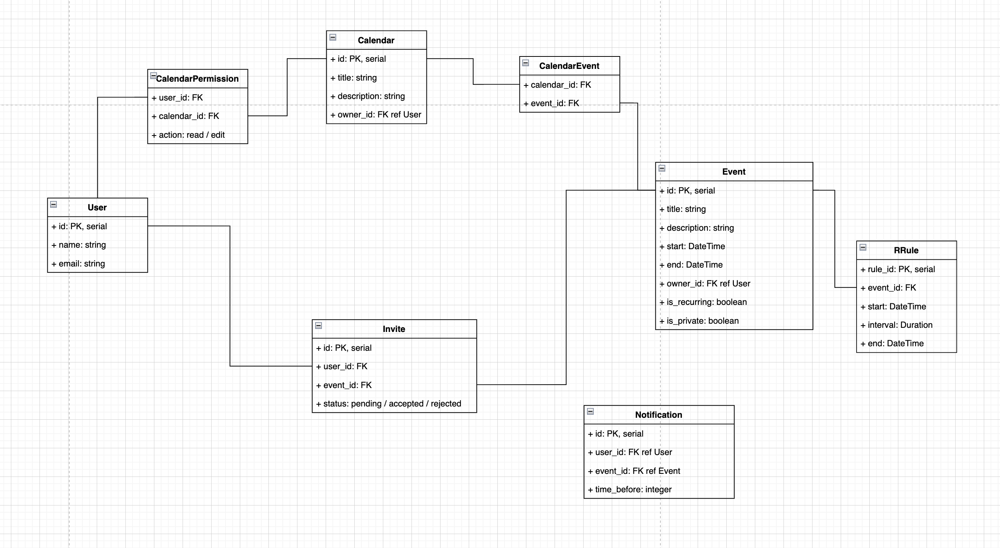

# MyCalendar

This is a simple implementation of Calendar (aka Google Calendar)

This project was made as a test case for interview in "Joom"

Authored by Dmitrii Proskurin (dimapr117@gmail.com)

## How to start service
```shell
./start.sh  <-- to start
./stop.sh   <-- to stop
```

## Run tests
```shell
./run_tests.sh
```


## API specification

### Create user
  * endpoint: `/api/create/user`
  * POST HTTP query
  * user description should be posted in body as JSON
```shell
curl --request POST 'localhost:8000/api/create/user' \
--data-raw '{
    "name": "Guest",
    "email": "guest@gmail.com"
}'
```

### Create event
  * endpoint: `api/create/event`
  * POST HTTP query
  * event description should be posted in body as JSON
```shell
curl --request POST 'localhost:8000/api/create/event' \
--data-raw '{
    "title": "Example event",
    "description": "This field is optional",
    "start": "2022-04-20T08:00:00",
    "end": "2022-04-20T10:00:00",
    "owner_email": "dimapr117@gmail.com",
    "is_recurring": "True",
    "repeats": ["daily"],
    "invited_emails": ["guest@gmail.com"]
}'
```

### Info about user
  * endpoint `api/info/user/<int:user_id>`
  * GET HTTP query
```shell
curl --request GET 'localhost:8000/api/info/user/1'
```

### Show detail info about event
  * endpoint: `api/info/user/<int:user_id>/event/<int:event_id>`
  * GET HTTP query
  * `user_id` param specifies who is asking for info about the event. 
If the event is private for user_id then only open2world part will be shown 
```shell
curl --request GET 'localhost:8000/api/info/user/1/event/2'
```

### Accept or Reject invite to event
  * endpoint `api/update/invite/<int:invite_id>`
  * PUT HTTP query
  * New status for invite (ACCEPTED / REJECTED) should be provided as parameter `status`
```shell
curl --request PUT 'localhost:8000/api/update/invite/2?status=REJECTED'
```

### Look up your invites list
  * endpoint `api/info/user/<int:user_id>/invites`
  * GET HTTP query
  * Filter parameter `status` can specify type of invites to return. By default all invites are returned
```shell
curl --request GET 'localhost:8000/api/info/user/1/invites'
curl --request GET 'localhost:8000/api/info/user/1/invites?status=PENDING'
```

### Show all events instances (like timetable) of user by specified period of time
  * endpoint `api/info/user/<int:user_id>/events`
  * GET HTTP query
  * Params `from` and `till` should be provided
```shell
curl --request GET 'localhost:8000/api/info/user/1/events?from=2022-04-19T00:00:00&till=2022-04-23T00:00:00'
```

### Find first free time slot for group of people for the event
  * endpoint `api/timetable/free_time_slot`
  * GET HTTP query
  * Params `user_ids` and `duration` should be provided 
```shell
curl --request GET 'localhost:8000/api/timetable/free_time_slot?user_ids=1,2,3&duration=1:00:00'
```


## Data Model Schema



